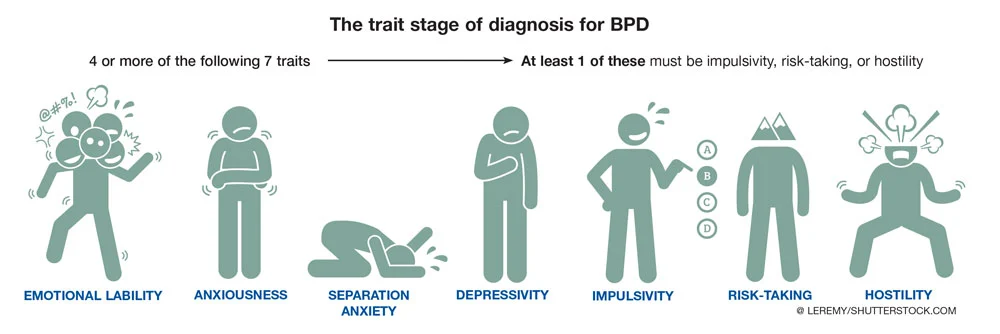

## Welcome to my website!
# Neglected Mental Illness——Borderline Personality Disorder

When you think of mood disorders, depression and bipolar disorder likely come to mind first. However, Borderline personality disorder (BPD) is also a common personality disorder in psychiatry, which is mainly characterized by emotional, interpersonal relationships, self-image, and behavioral instability, and is accompanied by a variety of impulsive behaviors. It is a complex and serious mental disorder.  People with a borderline personality disorder may experience intense episodes of anger, depression, and anxiety that can last from a few hours to days. The typical characteristics of borderline personality disorder have been described by scholars as "stable instability", which often manifests as non-compliance in treatment, which is very difficult to treat.

Many therapists find that in the consultation, the visitor does not come to the psychiatrist with the main line of the problem of borderline personality disorder. They will use psychological problems such as emotional problems, intimacy problems, professional development problems, interpersonal relationships, etc. for psychological counseling. . But in the end, it was found that a certain percentage of people were accompanied by borderline personality disorder.

Some visitors with borderline personality disorder may be ignored from diagnosis to consultation, which will produce some bad results. First, because the diagnosis is not accurate, the consultation will be conducted from the emotional or relationship perspective, making the consultation untargeted, which will affect the effectiveness of the consultation. The second is that if the consultant does not have a clear idea of borderline personality disorder, this problem will inadvertently hurt the consultant. Because people with borderline personality disorder are not sure about relationships, they do not have a stable relationship model and cognition.

### What is personality disorder

Personality disorder refers to a person who is too prominent or significantly enhanced in some aspects of his personality, resulting in long-term inability to adapt to the living environment and inconvenience to interpersonal communication. To put it simply, personality is a stable way to reflect a particular situation, while personality disorder is reflected in the fact that the way of reflecting on the situation is not stable enough to hinder others.

There are many types of personality disorders. Generalized personality disorders include: paranoid personality disorder, schizotypal personality disorder, schizotypal personality disorder, borderline personality disorder, dependent personality disorder, compulsive personality disorder, performance personality disorder, avoidance Personality disorder, narcissistic personality disorder, antisocial personality disorder.

How much do you know about borderline personality disorder? Let's get to know it!

### Signs and Symptoms

Borderline personality disorder can negatively affect patients' daily lives, relationships, and self-esteem. BPD-related symptoms usually begin in adolescence, and are often Suicidal or non-Suicidal. According to the American Psychiatric Association (APA), you may have BPD if you meet the following 5 symptoms and above:

1. Efforts to avoid real or imagined abandonment: such as rapidly initiating intimate (physical or emotional) relationships or cutting off communication with someone in anticipation of being abandoned.
2. Interpersonal tension and instability: often feel disappointed and rejected and swing from extreme closeness and love (idealization) to extreme dislike or anger (devaluation).
3. Disorder of self-image or sense of self: such as inferiority, self-doubt on self-worth, friendship, and sexual orientation
4. Impulsive behavior: emotional use rather than rational thinking.
5. Self-harming behavior: such as cutting, drinking, overeating, etc.
6. Emotional instability: easy to produce big emotional ups and downs due to small things.
7. Long-term chronic feelings of emptiness
8. Feeling of dissociation: such as feeling that seeing oneself from outside one's body.

 

## How BPD affects relationships

The most common BPD behaviors and symptoms could be detrimental to any relationship. If you have been diagnosed with the condition, you likely know this already. People with BPD are more likely to have many romantic relationships, which are often short-lived.

An individual who is seen as a friend one day may be considered an enemy or traitor the next. These shifting feelings can lead to intense and unstable relationships.

They felt that the other person was the best person for a while, and they followed others for a lifetime. They felt that the other person was the worst person for a while, and they could not wait to leave others immediately. Or it is extremely fearful that others will abandon themselves, either seek too much comfort, or directly break the relationship to protect themselves.

### Self-test

You may find that many parts of your life are affected, including relationships, work or school. If you notice these things on your own, tell your doctor or counselor. The right treatment can help you feel better and help you live a more stable and meaningful life.

If you find these conditions among your family members or friends, tell them to see a doctor or see a counsellor. But remember you can't force anyone to ask for help. If you are overly sad about this relationship, you will find it helps to heal yourself.

### Risk Factors

In terms of personal experience and social environment, it includes various significant traumatic experiences and insignificant, but long-term traumatic experiences.

1. Either real or fear of abandonment in childhood or adolescence.
2. Brain Factors: In the area that control impulses and emotional regulation of brain have structural and functional changes.
3. Poor communication in the family.
4. Sexual, physical or emotional abuse.
5. Sudden traumatic events (including suicides, criminal cases, natural disasters, car accidents, etc.)

### Treatments and Therapies
In terms of treatment, hallucinations and delusions are obvious and require a small amount of drugs in combination with treatment; those with poor self-functions can undergo supportive psychotherapy; some of them have stronger self-functions and better tolerance can consider long-term psychoanalytic treatment.

# Therapy
According to current clinical studies, the most empirical and preferred intervention for borderline personality disorder is Dialectical Behaviour Therapy (referred to as DBT). Personal, collective, and telephone counseling, dialectical behavior therapy is usually based on teaching people how to regulate their emotions, endure pain, and improve relationships.

Co-morbidities should also be considered clinically. Borderline personality disorders often appear simultaneously with the following clinical conditions:
· Other personality disorders
· Depression
· Drug abuse
· Anxiety
· Eating disorders
· Bipolar disorder

If the eating disorder is severe, it is best to receive treatment for eating disorder first, then DBT.
If it is PTSD for post-traumatic stress disorder, you can receive DBT first and then PTSD. If the drug addiction is more serious, then you need to get detox before starting DBT. 
If it is severe depression, you can consider starting medication and then DBT after the disease is stable.

# Medication
There is no medication that can treat BPD, but antidepressants, antianxiety drugs, and antipsychotics may help treat some of the symptoms.

# Hospitalization
If you begin showing signs of self-harm or suicidal ideation, a doctor may hospitalize you for observation and intensive therapy.

### Diagnostic criteria
There are many diagnostic tools for research and diagnosis of borderline personality disorder, DIB, DIPD-IV (Diagnostic Interview for DSM-IV Personality Disorders), IPDE (the International Personality Disorder Examination), SIDP-Ⅳ (the structured Interview for DSM-IV Personality), PDI- Ⅳ (the Personality Disorder Interview-Ⅳ), SCID-Ⅱ (Structured Clinical Interview for DSM-Ⅳ AxisⅡ Personality Disorders), etc.

The most authoritative diagnostic criterion for borderline personality disorder is DSM-IV (Fourth Edition of the American Diagnostic and Statistical Manual of Mental Disorders).

### How to Help Loved Ones with Borderline Personality Disorder

# Setting Boundaries with Your Loved One. 
Talk to your loved one about boundaries at a time when you’re both calm, not in the heat of an argument.
Let your loved one know you still love him or her. 
Know when to walk away.

# Communicating with Your Loved One
Focus on the emotions, not the words. 
Listen actively and be sympathetic. 
Talk about things other than the disorder. 
Watch for destructive behavior. 

# Taking Care of Yourself
Avoid the temptation to isolate.
Realize it isn't about you.
Remember you can't fix your loved one. 
Join a support group for BPD family members.

### Seek treatment

If you or someone you know is in crisis, call the toll-free National Suicide Prevention Lifeline (NSPL) at 1-800-273-TALK (8255), 24 hours a day, 7 days a week. The service is available to everyone. The deaf and hard of hearing can contact the Lifeline via TTY at 1-800-799-4889. All calls are free and confidential. Contact social media outlets directly if you are concerned about a friend’s social media updates or dial 911 in an emergency. Read more on NIMH’s Suicide Prevention health topic page.
